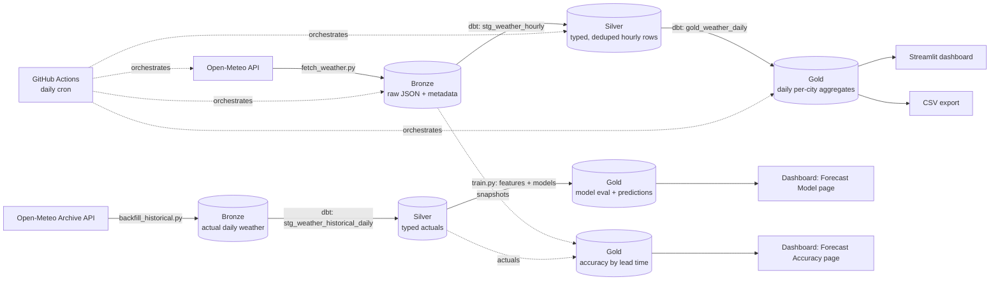

# Weather Medallion Pipeline

A batch ELT pipeline that pulls live hourly forecast data from the
[Open-Meteo](https://open-meteo.com/) API for eight cities worldwide and
runs it through a bronze → silver → gold medallion architecture using dbt
and DuckDB. Scheduled and orchestrated with GitHub Actions; served through
a Streamlit dashboard.

On top of the same infrastructure, a **data science extension** (`ds/`)
asks two questions about the forecasts this pipeline collects: how good
are they, and can a purpose-built model do better on next-day temperature?
See [DS project](#data-science-extension) below.

**Live dashboard:** _add your Streamlit Community Cloud URL here after deploying_

## Architecture



**Bronze** — `ingestion/fetch_weather.py` calls the Open-Meteo forecast API
for each city in `ingestion/cities.py` and lands the raw JSON response,
untouched, into a DuckDB table (`bronze.weather_raw`) with ingestion
metadata (timestamp, city, coordinates). No parsing happens here on
purpose: if the API's schema shifts, ingestion still succeeds and nothing
breaks until the next layer.

**Silver** — `dbt_project/models/staging/stg_weather_hourly.sql` unnests
the raw JSON into one typed row per city per forecast hour, and
deduplicates to each city's latest ingestion run.

**Gold** — `dbt_project/models/marts/gold_weather_daily.sql` aggregates
silver into daily per-city metrics (avg/min/max temperature, humidity,
total precipitation, max wind speed) — the layer any dashboard or BI tool
should read from.

**Orchestration** — `run_pipeline.py` runs ingestion, then `dbt run`, then
`dbt test`, in order. `.github/workflows/pipeline.yml` runs that script on
a daily cron via GitHub Actions and commits the refreshed DuckDB file back
to the repo, so the pipeline is actually live and re-running on a schedule,
not just a one-time script.

**Serving** — `dashboard/app.py` is a Streamlit app that reads only from
the gold layer.

## Data science extension

The DE pipeline above answers "what's the forecast." The `ds/` extension
asks two follow-up questions using the same DuckDB warehouse and the same
medallion discipline:

**1. Can a model beat a naive baseline at next-day temperature forecasting?**
`ds/backfill_historical.py` pulls actual (not forecast) daily weather for
the same eight cities from Open-Meteo's free Archive API (ERA5
reanalysis) — years of history in one call, no waiting for the daily
pipeline to accumulate it. `dbt` parses that into a silver table
(`stg_weather_historical_daily`), then `ds/features.py` builds lag,
rolling-window, and seasonal features and `ds/train.py` trains and
compares three models: a persistence baseline ("tomorrow = today"), linear
regression, and XGBoost — evaluated on a **chronological** hold-out (the
most recent 90 days), never a random split, since randomly shuffling a
time series leaks future information into training. Results (MAE/RMSE,
predictions, feature importance) land in gold tables and render on the
dashboard's "Forecast Model" page. `tests/test_features.py` specifically
tests for leakage: that lag/rolling features never see the current or a
future row, and that the target is genuinely next-day.

**2. Does the forecast this pipeline collects get less accurate the
further out it predicts?** The DE pipeline's `bronze.weather_raw` table
is append-only, so the same calendar date accumulates predictions made at
different lead times as the daily job keeps running. `ds/eval_forecast_accuracy.py`
joins those snapshots against confirmed actuals (once the archive API has
finalized them, ~5 days later) and aggregates mean absolute error by lead
time, rendered on the dashboard's "Forecast Accuracy" page. **This table
starts empty right after launch** — it fills in as the daily GitHub
Actions run accumulates history, the same way the DE pipeline's own
history builds up over time. That's expected, not a bug.

Run it:

```bash
python3 ds/run_ds_pipeline.py --years 2   # one-time: backfill + dbt + train
streamlit run dashboard/app.py             # then open the DS pages in the sidebar
```

The daily GitHub Actions workflow re-runs the accuracy tracker automatically
(best-effort — it no-ops gracefully on a repo where the one-time backfill
hasn't happened yet); re-run `ds/train.py` periodically as more history
accumulates to retrain on a growing dataset.

## Why these choices

- **DuckDB** instead of a hosted warehouse: zero cost, zero setup, and the
  whole pipeline is reproducible by anyone who clones the repo — no cloud
  account needed to run it locally.
- **dbt** for all silver/gold logic: SQL-based transforms, version
  controlled, tested, and documented the way a real data team would do it,
  rather than ad hoc pandas transforms in a notebook.
- **GitHub Actions as the phase-1 orchestrator**: free, requires no
  infrastructure to stand up, and gives a verifiable run history (check the
  Actions tab / commit history for daily runs) instead of a pipeline that
  only "works on my machine."
- **A live public API** instead of a static CSV: this is an ELT pipeline
  with incremental runs, not a one-off analysis of a dataset that never
  changes.
- **A chronological, not random, train/test split** for the DS models:
  the standard mistake in time-series ML is a random shuffle that leaks
  future rows into training. The hold-out here is strictly the most
  recent N days.
- **A persistence baseline before any ML model**: reporting only an
  XGBoost MAE without a baseline to compare it to hides whether the model
  is actually earning its complexity.

## Running it locally

```bash
python3 -m venv .venv && source .venv/bin/activate
pip install -r requirements.txt

python3 run_pipeline.py         # ingests + runs dbt + tests
streamlit run dashboard/app.py  # view the dashboard locally
```

## Testing

- `pytest` — unit tests for the ingestion logic (API call, bronze landing,
  end-to-end run), with the API mocked so the suite runs offline and in CI;
  plus leakage tests for the DS feature engineering (lag/rolling features
  never see the current or a future row, the chronological split never
  overlaps, the target is genuinely next-day).
- `dbt test` — schema tests on the silver and gold models (not-null,
  uniqueness of `(city, forecast_date)` in the gold table).

## Roadmap (in progress)

This project ships in phases; phase 1 (above) is complete and live. Next:

- [ ] Replace the GitHub Actions cron with a real Airflow DAG (containerized
      via Docker Compose) to demonstrate task-level retries, backfills, and
      dependency graphs.
- [ ] Add a Dockerfile / docker-compose.yml so the whole stack (ingestion +
      dbt + Postgres) runs with one command.
- [ ] Swap DuckDB for a cloud warehouse (BigQuery or Snowflake free tier)
      to demonstrate a cloud-native deployment.
- [ ] Add dbt data freshness checks and Slack/email alerting on pipeline
      failure.
- [ ] Expand to a second data source (e.g. air quality) and a `dim_cities`
      dimension table to demonstrate a small star schema.
- [ ] DS: once the accuracy-by-lead-time table has real history, retrain
      periodically and track whether the model's edge over the persistence
      baseline holds up out of sample over time (not just on one hold-out).
- [ ] DS: try a proper time-series model (e.g. Prophet) as a fourth point
      of comparison alongside persistence / linear / XGBoost.

## Repo structure

```
ingestion/            bronze layer: API client + city reference list (DE)
dbt_project/          silver + gold dbt models, tests, sources (DE + DS, tag:ds separates them)
dashboard/             Streamlit app: main page (DE) + DS pages under pages/
ds/                    DS project: historical backfill, features, training, accuracy tracker
tests/                 pytest: ingestion (mocked API) + DS feature leakage tests
.github/workflows/     scheduled pipeline run (daily cron)
run_pipeline.py         DE orchestrator: ingest -> dbt run -> dbt test
ds/run_ds_pipeline.py   DS orchestrator: backfill -> dbt -> train -> accuracy tracker
data/                   DuckDB file + CSV export (committed by CI)
```
